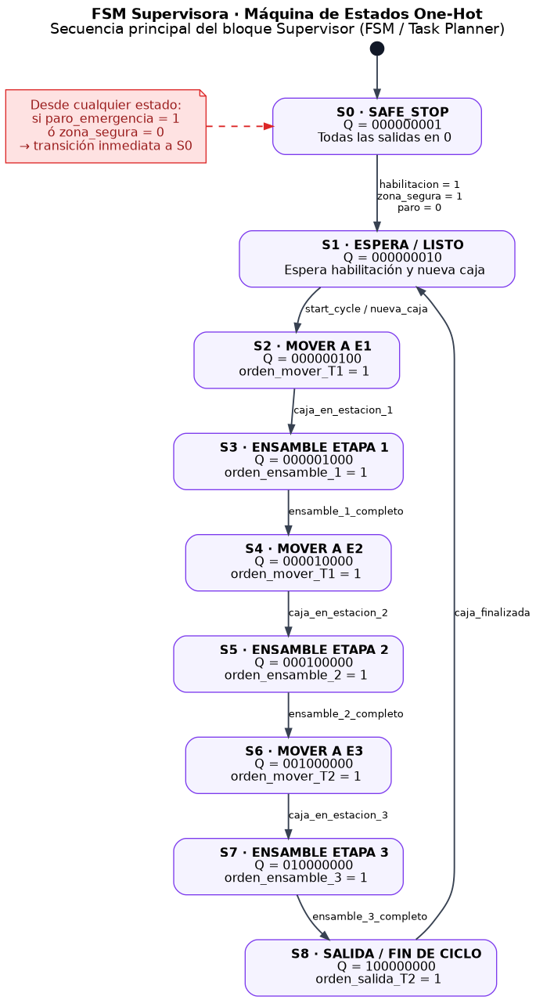

# Máquina de estados - Grupo 1

Esta carpeta contiene el desarrollo correspondiente al bloque **Supervisor FSM / Task Planner** del proyecto.  
La FSM se encarga de coordinar la secuencia global de producción, habilitando transporte, estaciones de ensamble y salida final de la caja terminada.

## Objetivo del bloque

Supervisar el flujo completo del proceso de ensamble mediante una **máquina de estados finitos en arquitectura one-hot**, garantizando que cada etapa solo inicie cuando la etapa anterior haya sido confirmada y que, ante una condición de seguridad, el sistema vuelva inmediatamente a un estado seguro.

## Estructura interna

- `src/`: código fuente de la FSM y lógica de control
- `docs/`: documentación técnica del bloque
- `images/`: diagramas, capturas y esquemas de la FSM

## Diagrama de la FSM

## Enfoque de diseño

La máquina fue planteada como una **FSM Moore one-hot** por practicidad de implementación, depuración y escalabilidad.

### ¿Por qué one-hot?
- Simplifica la lógica de decodificación de estados
- Hace más clara la activación de salidas por estado
- Facilita depuración en simulación y hardware
- Reduce complejidad al mapear cada estado a una única bandera activa

En este enfoque, **solo un bit está en 1 a la vez**, representando el estado actual del supervisor.

## Secuencia funcional del supervisor

La secuencia general controlada por la FSM es:

1. Estado seguro / sistema detenido
2. Espera de habilitación y nueva caja
3. Movimiento de caja hacia estación 1
4. Ensamble de etapa 1
5. Movimiento de caja hacia estación 2
6. Ensamble de etapa 2
7. Movimiento de caja hacia estación 3
8. Ensamble de etapa 3
9. Salida de caja finalizada
10. Retorno al estado de espera para iniciar un nuevo ciclo

## Estados definidos

| Estado | Nombre | Codificación one-hot | Acción principal |
|---|---|---:|---|
| S0 | SAFE_STOP | `000000001` | Todas las salidas en 0 |
| S1 | ESPERA / LISTO | `000000010` | Espera habilitación y nueva caja |
| S2 | MOVER A E1 | `000000100` | Activa transporte 1 hacia estación 1 |
| S3 | ENSAMBLE ETAPA 1 | `000001000` | Ordena ensamble en estación 1 |
| S4 | MOVER A E2 | `000010000` | Activa transporte 1 hacia estación 2 |
| S5 | ENSAMBLE ETAPA 2 | `000100000` | Ordena ensamble en estación 2 |
| S6 | MOVER A E3 | `001000000` | Activa transporte 2 hacia estación 3 |
| S7 | ENSAMBLE ETAPA 3 | `010000000` | Ordena ensamble en estación 3 |
| S8 | SALIDA / FIN DE CICLO | `100000000` | Activa salida de caja terminada |

## Entradas principales al supervisor

Las señales de entrada consideradas para la FSM son:

- `habilitacion`
- `paro_emergencia`
- `zona_segura`
- `start_cycle` o `nueva_caja`
- `caja_en_estacion_1`
- `ensamble_1_completo`
- `caja_en_estacion_2`
- `ensamble_2_completo`
- `caja_en_estacion_3`
- `ensamble_3_completo`
- `caja_finalizada`

## Salidas principales del supervisor

Las órdenes generadas por el supervisor son:

- `orden_mover_T1`
- `orden_ensamble_1`
- `orden_ensamble_2`
- `orden_mover_T2`
- `orden_ensamble_3`
- `orden_salida_T2`

## Reglas de transición

La FSM propuesta sigue las siguientes transiciones:

- `S0 -> S1` cuando `habilitacion = 1`, `zona_segura = 1` y `paro_emergencia = 0`
- `S1 -> S2` cuando existe `start_cycle` o `nueva_caja`
- `S2 -> S3` cuando `caja_en_estacion_1 = 1`
- `S3 -> S4` cuando `ensamble_1_completo = 1`
- `S4 -> S5` cuando `caja_en_estacion_2 = 1`
- `S5 -> S6` cuando `ensamble_2_completo = 1`
- `S6 -> S7` cuando `caja_en_estacion_3 = 1`
- `S7 -> S8` cuando `ensamble_3_completo = 1`
- `S8 -> S1` cuando `caja_finalizada = 1`

### Condición global de seguridad
Desde **cualquier estado**, si:

- `paro_emergencia = 1`, o
- `zona_segura = 0`

la FSM debe regresar inmediatamente a:

- `S0 = SAFE_STOP`

## Interpretación operativa

El supervisor no realiza directamente el ensamble ni el transporte.  
Su función es **autorizar y secuenciar** las acciones del sistema completo, verificando confirmaciones de cada subsistema antes de pasar al siguiente estado.

Esto permite:

- coordinación centralizada
- control secuencial robusto
- trazabilidad del ciclo
- integración clara con sensores y confirmaciones de proceso
- respuesta inmediata ante fallas de seguridad

## Lógica de implementación sugerida

La implementación recomendada es de tipo **Moore**, donde las salidas dependen principalmente del estado activo.

Ejemplo conceptual:

- Si el estado activo es `S2`, se activa `orden_mover_T1`
- Si el estado activo es `S3`, se activa `orden_ensamble_1`
- Si el estado activo es `S5`, se activa `orden_ensamble_2`
- Si el estado activo es `S6`, se activa `orden_mover_T2`
- Si el estado activo es `S7`, se activa `orden_ensamble_3`
- Si el estado activo es `S8`, se activa `orden_salida_T2`

## Relación con el diagrama de bloques del proyecto

Este bloque corresponde al **Sistema Supervisor de Producción (FSM / Task Planner)** mostrado en el diagrama general.  
Es el bloque responsable de enviar las órdenes a:

- Sistema de Transporte 1
- Estación de Ensamble 1
- Estación de Ensamble 2
- Sistema de Transporte 2
- Estación de Ensamble 3
- Estación de salida

y de recibir las confirmaciones necesarias para continuar el ciclo.

## Responsables

- Juan Sebastian Osuna — alias **KRUSTY**
- Santiago Acevedo Porras — **EL GOAT**
- Cristian Orlando — alias **El Ratón FIMBAR**
- Julián Piedra — “que piedra”

## Estado

**Diseño de FSM definido en arquitectura one-hot.**  
Pendiente: implementación final en código, pruebas de transición y validación integrada con el resto de bloques.
